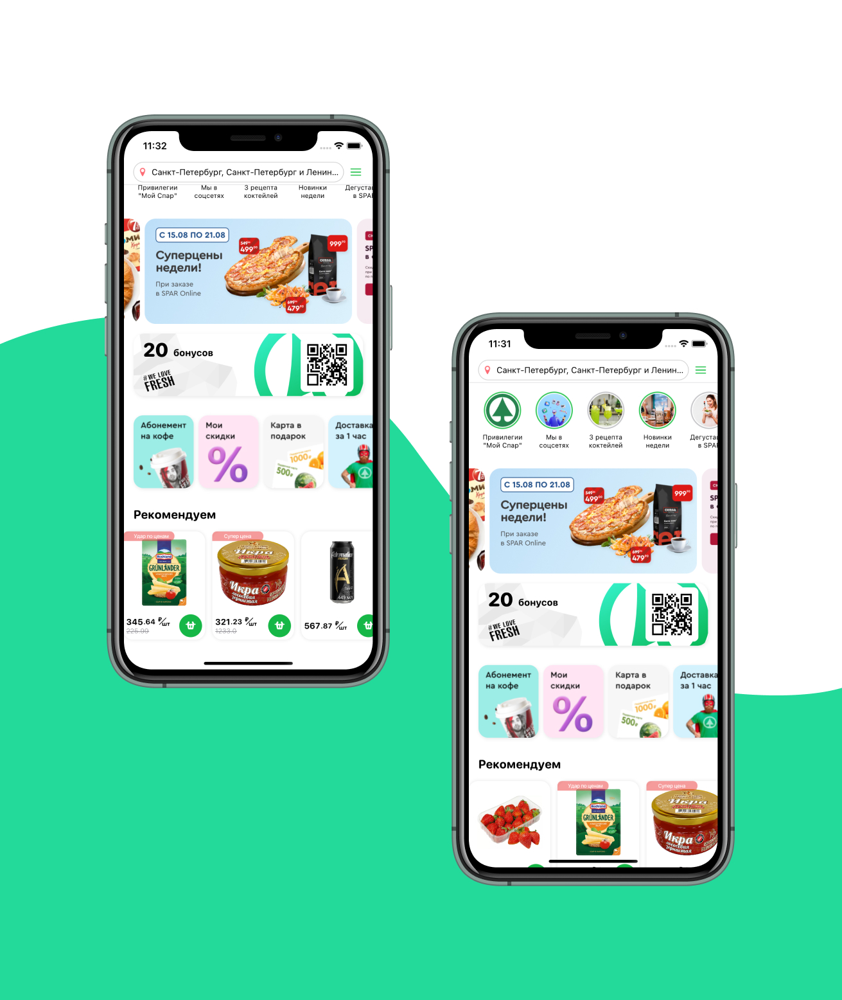

# SparCloneApp

Тестовое задание для компании 1221Системс

## Как сделано

- SwiftUI
- IOS 14+

## Скриншоты

## Что можно улучшить

- Во-первых, только один блок ("discounts") реализован с имитацией infinity scrolling (как и в оригинальном приложении) - однако там он реализован  и для блока с продуктами, чего нет у меня.

- Во-вторых, добавить больше разделов и различных продуктов, да и в общем больше элементов (историй, предложений, категорий).

  Все это сделать несложно, просто нужно время и силы на рутиную работу (ручное добавление картинок в папку с ассетами))

